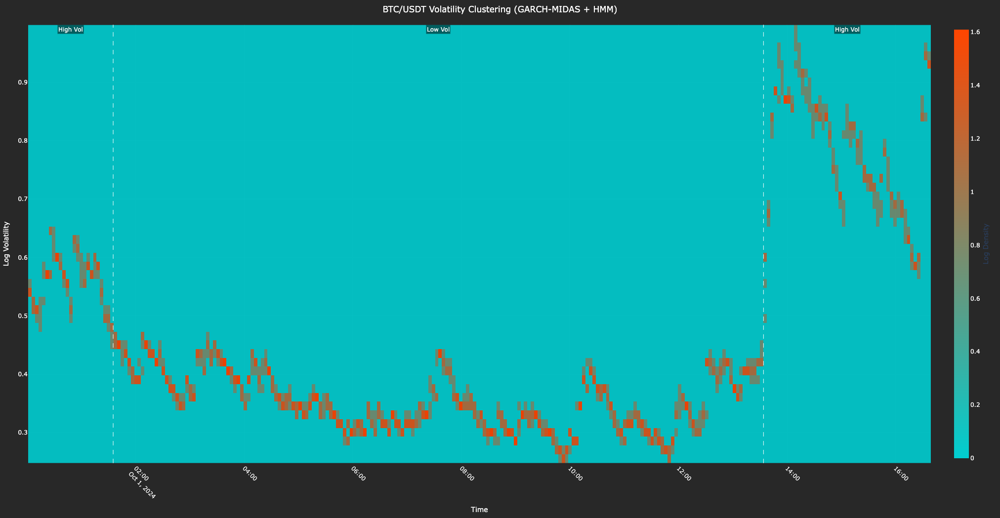
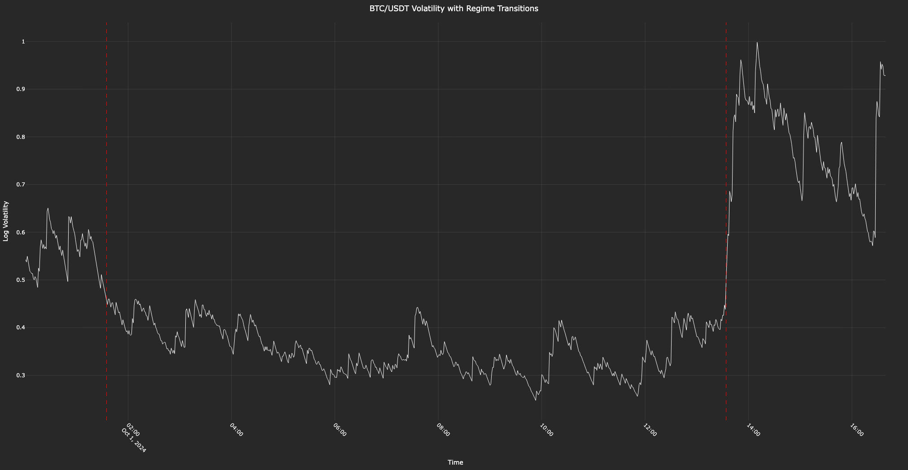

# CryptoVolRegimes

- This project analyzes Bitcoin (**BTC/USDT**) volatility clustering using GARCH-MIDAS for short- and long-term volatility components and Hidden Markov Models (HMM) to detect volatility regimes.
- It fetches high-frequency data, fits models, and visualizes results as a volatility heatmap and a time series with regime transitions.

---

## Files
- `crypto_vol_regimes.py`: Main script for fetching data, fitting GARCH-MIDAS and HMM, and generating visualizations.
- No external dataset required; data is fetched live from Binance via `ccxt`.
- `heatmap.png`: Volatility clustering heatmap with regime annotations - Colors: `#00CED1` (low) to `#FF4500` (high).
- `timeseries.png`: Volatility time series with regime transition lines.

---

## Libraries Used
- `numpy`
- `pandas`
- `plotly.graph_objects`
- `ccxt`
- `datetime`
- `arch` (for GARCH-MIDAS)
- `hmmlearn` (for HMM)

---

## Timeframe
- **Input**: 1-minute spot data from **2024-10-01** to **2024-10-12** (configurable in code).
- **Output**: Volatility analysis and regime detection over this period.

---

## Features
- Fetches 1-minute BTC/USDT price data from Binance.
- Fits a GARCH-MIDAS model to separate short-term and long-term volatility.
- Uses HMM to identify high and low volatility regimes.
- Visualizes volatility clustering as a heatmap and time series with regime transitions.

---

## Screenshots

